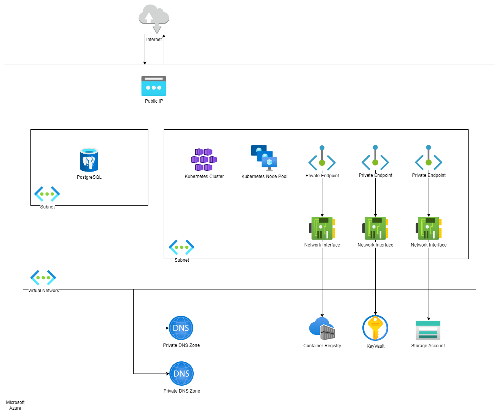

# sample-app-infra

## General Info

This is a sample app infra repository for deploying a microservice application to Microsoft Azure Cloud.

## Setup
To run this project, you need to have the following tools installed on your machine:
* Terraform (v1.4.6)
* Helm (v3.11.3)
* Azure CLI

## Usage

### Adding new Azure Resources
To add a new Azure resource, you need to add a new file in the [Terraform](Terraform) directory. The file should be named as the resource you want to create. For example, if you want to create a new Azure Kubernetes Service, you need to create a file named `aks.tf`. Next, create a pull request. The GitHub Actions workflow will run and apply the changes to the Azure Cloud.

### Adding / Modifying Helm Charts
To modify or add a new helm chart, create a new folder with the name of the chart in the [Helm](Helm) directory. Remember to build it with the `helm package`. Next, create a pull request and push the package in the respective folder. 

(#TODO: Add a GitHub Action to automatically package the helm chart and push it back to the repository)

## Infrastructure

### Azure Diagram
