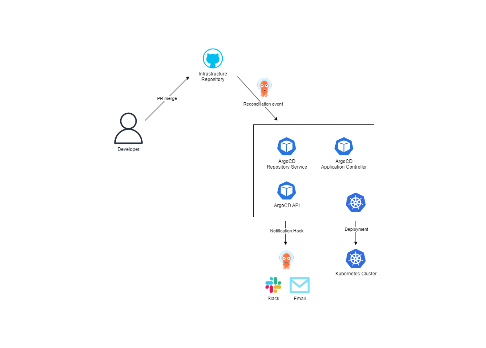

# Infrastructure ArgoCD Workflow

## What is ArgoCD?

ArgoCD is an open-source, declarative, GitOps continuous delivery tool for Kubernetes. It is designed to automate the deployment and management of applications in Kubernetes clusters using Git repositories as the source of truth for defining the desired state of the applications.

## How does the Argocd workflow look like?

- The developer changes the Argo application values file and pushes it to the repository.
- Argo detects the change in the repository and starts the reconciliation process:
    - it clones the repository and compares the current state of the application with the desired state defined in the repository
    - if there are any differences, it will apply the changes to the cluster
- Argo monitors progress and reports the status back to the user
- The developer can check the status of the application in the Argo UI or the configured notification channel (Slack, Email, etc.)

ArgoCD works oppositely as well. If someone changes the application in the cluster, Argo will detect the change and try to reconcile the application state with the desired state defined in the repository.
