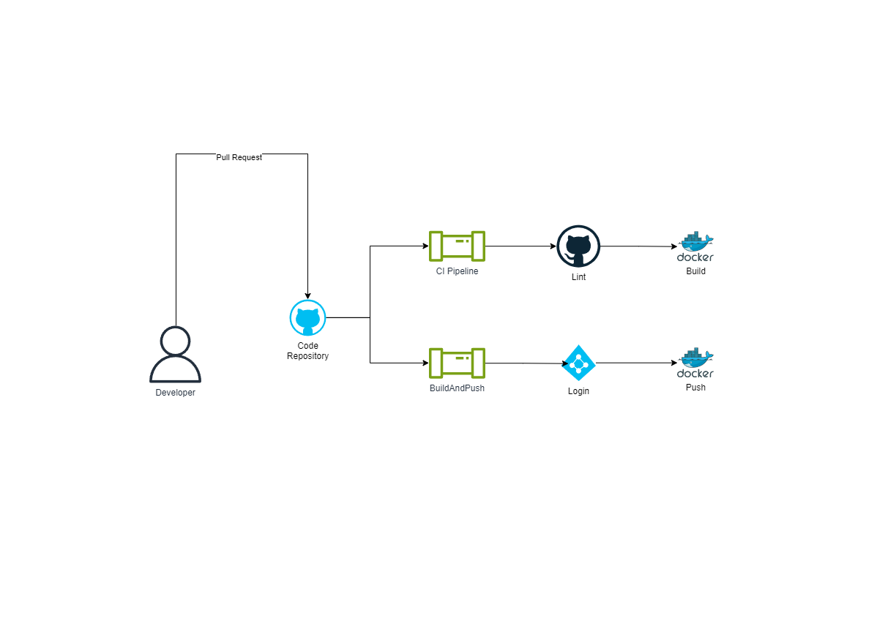

# Microservices Workflow

## Overview

sample-app consists of three microservices: sample-app-client, sample-app-core and sample-app-messaging. Each microservice has its repository and its pipeline. The sample-app-client repository contains the code for the front-end microservice, written in React and TypeScript. The sample-app-core repository contains the code for the back-end microservice, written in Python. The sample-app-messaging repository contains the code for the messaging microservice, written in Python.

All three of them have their own respective pipelines but with certain similarities. Each repository has a main (prod) branch and dev branch as well as 3 pipelines: CI, build-and-push-dev and build-and-push-prod.

CI pipelines run every time the developer creates a pull request.

For Python microservices:
- a lint stage, where the code is linted with flake8 and in case of any linter issues the faulty lines are commented on by the bot and the PR itself is unable to be merged until the issues are fixed
- a build stage, where the code is being built to check if the app builds properly

For React microservices:
- a build stage, where the code is being built to check if the app builds properly

The build-and-push-dev and build-and-push-prod pipelines run every time the developer pushes to either dev or prod branch. They have almost the same stages as the CI pipelines but with the addition of a push to the container registry tasks, which log in to Azure and push the built image to the container registry.

This approach makes sure that the code is always linted and appropriately built before it is merged into a parent branch.