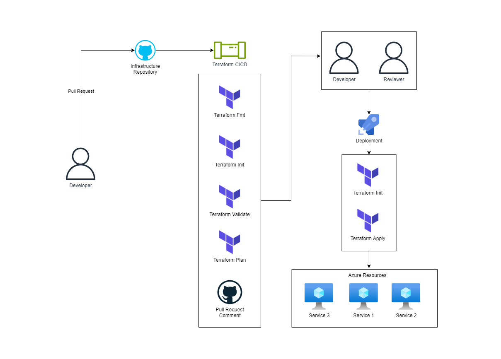

# Infrastructure Terraform Workflow

## What is Terraform?

Terraform is an open-source infrastructure as code software tool that provides a consistent CLI workflow to manage hundreds of cloud services. It codifies infrastructure in configuration files that describe the topology of cloud resources.

## Overview 

- The developer changes the Terraform code and pushes it to the repository on the new branch.
- The developer creates a pull request and assigns it to the reviewer.
- Terraform pipeline:
    - Checks if the Terraform code is properly formatted
    - Runs the Terraform init command to initialize the working directory
    - Runs the Terraform validate command to validate the configuration files in a directory
    - Runs the Terraform plan command to create an execution plan
    - Creates a comment in the pull request with the execution plan
- The reviewer checks the execution plan and approves the pull request.
- The developer or reviewer either approves the deployment or denies it.
- If the deployment is approved, the pipeline runs the Terraform init and applies commands to initialize the directory and apply the changes to the infrastructure.
- The developer merges the pull request to the main branch.
